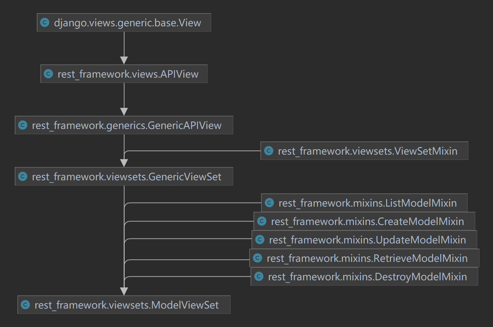
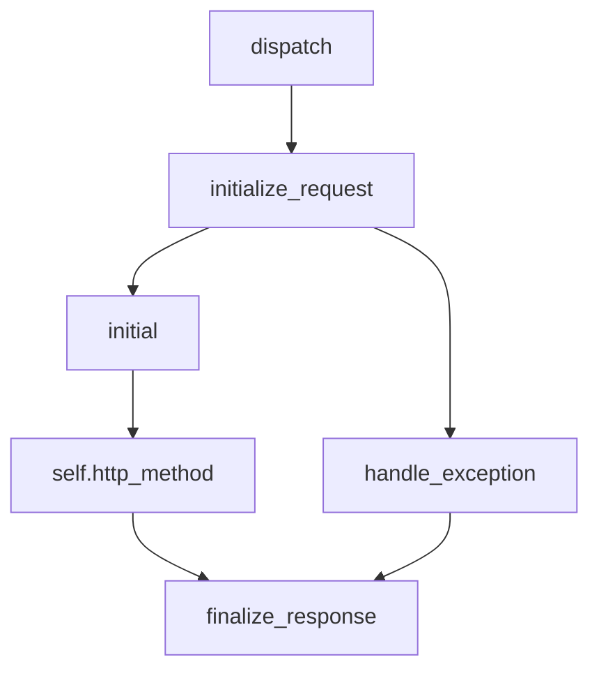

# 浅析Django及DRF的View(Set)

[DRF](https://www.django-rest-framework.org/)的视图类乍一看还挺多的，再加上数量众多的Mixin很容易眼花。这里从类继承关系入手，简单分析一下各个View(Set)的大概作用。

## 继承关系



DRF的视图类都是单继承的，只不过混入了额外的Mixin，看源码时可以先按照主线进行浏览，看功能时再去瞧瞧各个Mixin。

## View

`View`是Django唯一一个视图类，也是这个概念的根类。它通过`as_view()`从路由那里接收request，通过`dispatch()`转发到HTTP方法对应的类方法进行处理，然后返回response。

类视图比起函数视图的一个好处是：能够在任何地方通过类对象来访问（原始）请求内容，而不必处处都用传参的形式获取。这也是面向对象和面向过程的区别之一。

#### `View.as_view()`

这个方法将 **类视图** 转化为 **函数视图** ，用于填写到路由中。转化得到的函数视图包含了创建类视图、将request内置到对象中以共享给所有地方、转发request到对应的处理方法，这个过程涵盖了请求的整个生命周期。因此这个方法的文档注释才会说：这是HTTP请求响应处理的主入口。

```python
@classonlymethod
def as_view(cls, **initkwargs):
    """Main entry point for a request-response process."""
    for key in initkwargs:
        if key in cls.http_method_names:
            raise TypeError()
        if not hasattr(cls, key):
            raise TypeError()

    def view(request, *args, **kwargs):
        self = cls(**initkwargs)
        self.setup(request, *args, **kwargs)
        if not hasattr(self, "request"):
            raise AttributeError()
        return self.dispatch(request, *args, **kwargs)

    view.view_class = cls
    view.view_initkwargs = initkwargs
    view.__doc__ = cls.__doc__
    view.__module__ = cls.__module__
    view.__annotations__ = cls.dispatch.__annotations__
    view.__dict__.update(cls.dispatch.__dict__)

    return view
```

#### `View().dispatch()`

简单地将诸如GET请求转发到`self.get()`处理、POST请求转发到`self.post()`处理，接收方法返回值（response）并返回出去。

```python
def dispatch(self, request, *args, **kwargs):
    if request.method.lower() in self.http_method_names:
        handler = getattr(
            self, request.method.lower(), self.http_method_not_allowed
        )
    else:
        handler = self.http_method_not_allowed
    return handler(request, *args, **kwargs)
```

#### `View().options()`

OPTIONS请求的处理函数，是一个简单的处理请求、返回响应的函数模板，其它诸如GET、POST请求都是按照这个方法的参数和返回值编写对应的处理函数。

## APIView

DRF中只有位于最底层的`APIView`重写了`dispatch()`，相较于Django，DRF的`APIView`：

1. 使用了try-except进行兜底，这样就可以通过重写`self.http_method_not_allowed()`控制视图的报错；
2. 用了`self.finalize_response()`整理请求，这样就可以通过这个方法自定义response的格式。

```python
def dispatch(self, request, *args, **kwargs):
    self.args = args
    self.kwargs = kwargs
    request = self.initialize_request(request, *args, **kwargs)
    self.request = request
    self.headers = self.default_response_headers  # deprecate?

    try:
        self.initial(request, *args, **kwargs)
        if request.method.lower() in self.http_method_names:
            handler = getattr(self, request.method.lower(),
                              self.http_method_not_allowed)
        else:
            handler = self.http_method_not_allowed
        response = handler(request, *args, **kwargs)

    except Exception as exc:
        response = self.handle_exception(exc)

    self.response = self.finalize_response(request, response, *args, **kwargs)
    return self.response
```




