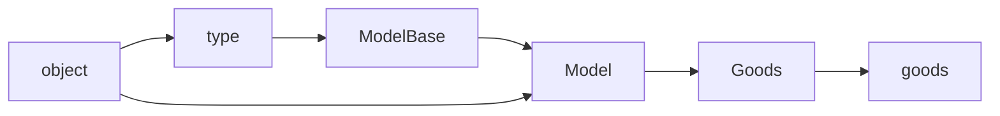
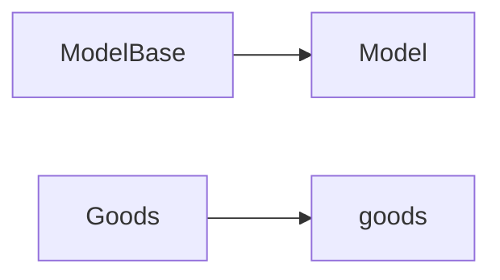
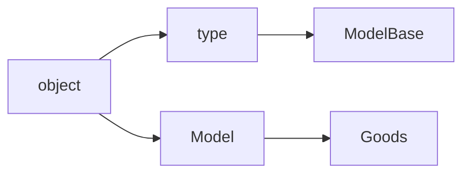

<style scoped>
.VPDoc p:not(.custom-block-title) {
    text-indent: 2em;
}
</style>

# 类与类型

<RevisionInfo />

<hr style="margin-top: 48px"/>

在万物皆对象的理念下，Python 的类实际上也是一个对象，或者叫实例，它是类型特殊实例化产生的东西，听起来就是类型 -> 类 -> 对象（type -> class -> object）。

> [!NOTE] 事先声明
> 自定义的类型以类的格式编写，这种特殊的类被称为[元类](https://docs.python.org/zh-cn/3/glossary.html#term-metaclass)（metaclass），但在下文与内置类型合并为一个概念 —— “类型” 。

意识到这一点的时候，我感觉 **类型** 与 **对象** 的关系剪不断、理还乱，于是下意识地寻找与类型系统有关的内置函数，有 [`isinstance`](https://docs.python.org/zh-cn/3/library/functions.html#isinstance) 、[`issubclass`](https://docs.python.org/zh-cn/3/library/functions.html#issubclass) 和 [`type`](https://docs.python.org/zh-cn/3/library/functions.html#type) ，前二者是用得比较多的。

以我最熟悉的 Django 为例，浏览其源码可知，`Model` 的类型是 `ModelBase` ，默认继承了 `object` ，而 `ModelBase` 继承了 `type` ：

```python
class ModelBase(type):
    def __new__(cls, name, bases, attrs, **kwargs):
        return super().__new__(cls, name, bases, attrs)

class Model(metaclass=ModelBase):
    pass
```

再自定义一个商品模型并创建相应对象：

```python
from django.db.models import Model

class Goods(Model):
    class Meta:
        app_label = 'my_app'

goods = Goods()
```

那么理应得到一棵关系树：



蔗很盒里。

但，我们无法作出以下断言：

```python
assert isinstance(goods, ModelBase)
assert issubclass(Goods, ModelBase)
assert issubclass(Model, ModelBase)
```

也就是说，`ModelBase` 看起来和后继关系毫无关系。

很久之后，我意识到了另外一点：类型系统中的两个重要行为——继承和实例化。回看这两个内置函数的文档，并稍稍动手试验后发现，`isinstance` 只用于判断实例化关系，而 `issubclass` 则只用于判断继承关系。

从实例化过程上看，这是两条独立的关系链：



因此以下断言为真：

```python
assert isinstance(Model, ModelBase)
assert isinstance(goods, Goods)
```

由于不在同一条关系链上，所以以下断言不通过：

```python
assert isinstance(goods, ModelBase)
```

而从继承树上看，这是两条只在根部相交的关系分支：



因此以下断言为真：

```python
assert issubclass(Goods, Model)
assert issubclass(Goods, object)
assert issubclass(Model, object)
assert issubclass(ModelBase, type)
assert issubclass(ModelBase, object)
```

由于不在同一个分支上，所以以下断言不通过：

```python
assert issubclass(Goods, ModelBase)
assert issubclass(Model, ModelBase)
```

浙很河里。

但，`goods` 和 `ModelBase` 到底有什么关系呢？？？

当我想起内置函数 `type` 并尝试将 `goods` 转化到隔壁时，解释器输出了以下结果：

```python
print(type(goods))  # <class '__main__.Goods'>
print(type(type(goods)))  # <class 'django.db.models.base.ModelBase'>
```

实际上，派生和实例化是两棵相互关联的树，即每一个叶子节点都是另一棵树的一个叶子节点，可以看到 `type` 能够求出目标被什么实例化（也就是实例化的类或者metaclass）。

```
            type
              |
              | 实例化
              |
 type --> ModelBase  (父类派生出子类)
   |          |
   |          | 实例化
   |          |
object ---> Model --> Goods  (父类派生出子类)
                       |
                       | 实例化
                       |
                     goods
```


